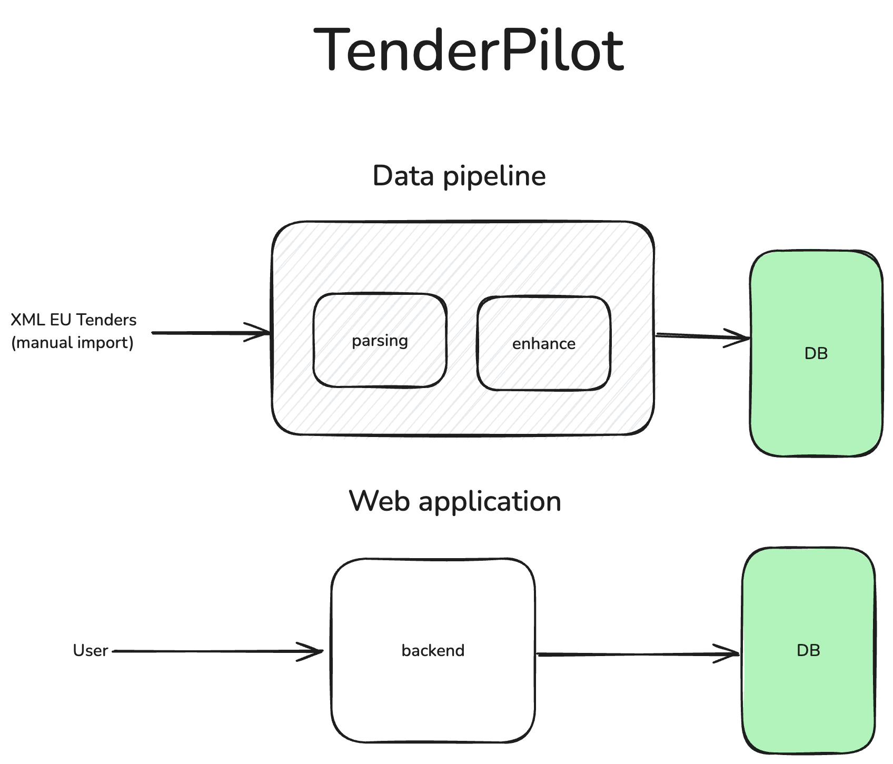
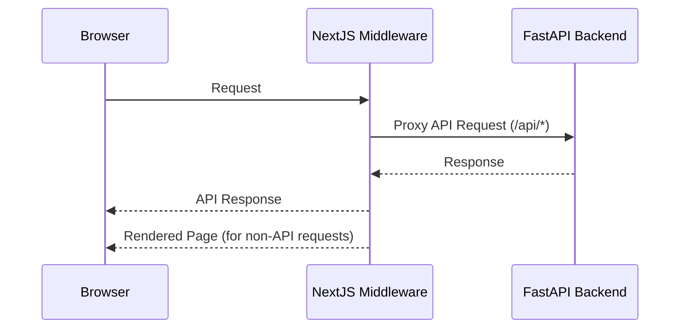

# TenderPilot

<p align="center">
  
</p>

TenderPilot helps you discover and evaluate [EU tenders](https://ted.europa.eu).

Work with TenderPilot to

- stay up to date with relevant tenders,
- screen tenders faster, and
- spend time preparing the tenders you are most likely to win.


## TenderPilot Architecture

## TenderPilot Architecture




## Components and Data Flow



# Setup

You need to run backend and frontend components.

## backend

### requirements
1. [Install uv](https://docs.astral.sh/uv/getting-started/installation/)
2. [Install docker](https://docs.docker.com/desktop/setup/install/mac-install/)
3. Run local mongo instance
```bash
docker run -p 27017:27017 -d mongo
```
---
### local development
1. Go to backend folder
2. Copy create `.env` based on `.env.example` in backend folder and set correct configuration properties
3. Run local server (environment should be automaticly created by uv with correct python and correct dependencies)
```
uv run fastapi dev
```

## frontend

### requirements
1. [Install bun](https://bun.sh/docs/installation)

###  local development
2. Go to frontend folder
3. Install packages 
```bash
bun i
```
4. Run application
```bash
bun run dev
```
